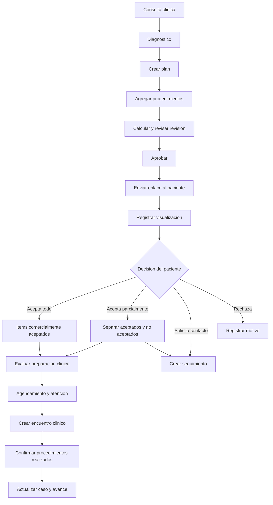
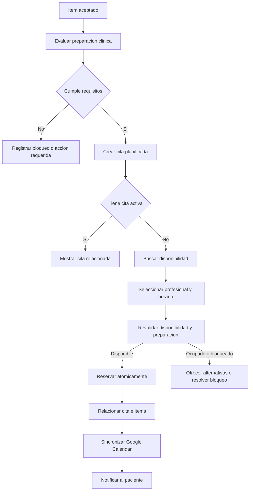
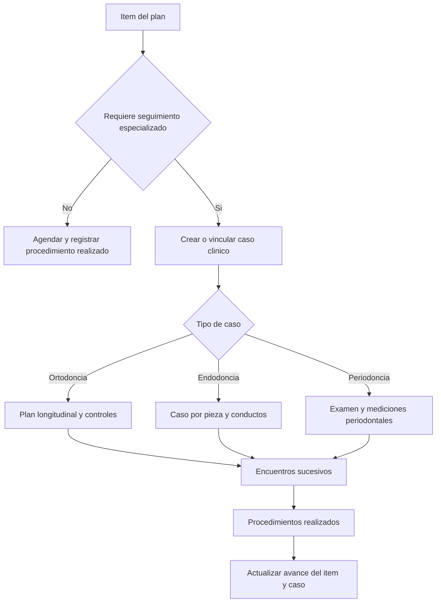
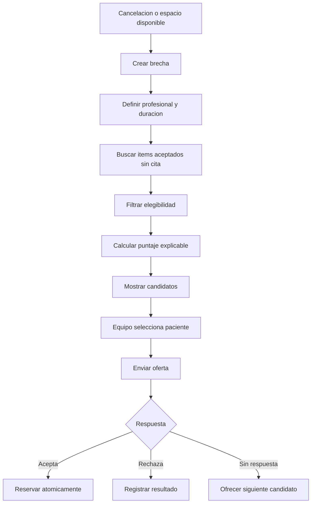

# Flujos y Reglas - Plan de Tratamiento y Presupuesto

## Flujo Principal



## Creacion Y Emision

1. El profesional crea el plan desde la ficha del paciente o una cita finalizada.
2. Registra diagnostico general y prioridad clinica.
3. Agrega procedimientos desde el catalogo.
4. OdonCRM copia nombre, codigo, precio, duracion y sesiones como snapshot.
5. El profesional completa pieza, superficie, prioridad y observaciones.
6. Un usuario autorizado revisa precios y descuentos.
7. El sistema calcula los totales en servidor.
8. Se aprueba una revision inmutable.
9. Se genera un enlace publico seguro.
10. El envio se registra con canal, destinatario y actor.

Reglas:

- Un doctor no modifica precios si no tiene permiso comercial.
- Un cambio posterior al envio crea una nueva revision.
- La revision anterior conserva su historial y respuesta.
- No se puede enviar un plan sin items vigentes.
- No se puede emitir un plan con precios o duraciones invalidas.

## Experiencia Del Paciente

El enlace debe mostrar:

- Identificacion minima del paciente y clinica.
- Titulo y vigencia del plan.
- Procedimientos, piezas y explicacion autorizada.
- Precio por item y total.
- Condiciones comerciales.
- Acciones para aceptar, rechazar, solicitar contacto o agendar.

El enlace no debe mostrar:

- Notas internas.
- Scores comerciales.
- Motivos internos de prioridad.
- Historial de otros pacientes.
- Datos clinicos no necesarios para la decision.

Acciones:

1. Aceptar todos los items vigentes.
2. Seleccionar items y aceptar parcialmente.
3. Rechazar items seleccionados.
4. Solicitar una llamada o mensaje.
5. Solicitar agendamiento para items aceptados.
6. Descargar la revision presentada.

Cada accion crea un evento y conserva la revision exacta sobre la cual se respondio.

## Conversion A Citas



Reglas:

- El paciente puede tener varias citas futuras.
- La duracion se calcula desde los items seleccionados y reglas configuradas.
- Todas las rutas de creacion y reprogramacion usan el mismo servicio de reserva.
- La reserva debe impedir doble booking a nivel transaccional.
- Un fallo de Google Calendar no debe perder la reserva interna.
- La sincronizacion externa debe tener reintentos y estado visible.
- La preparacion clinica valida historia revisada, diagnostico, secuencia, autorizacion, consentimiento, competencia profesional y bloqueos.
- El sistema revalida la preparacion antes de registrar el procedimiento realizado.

## Aceptacion Y Consentimiento

Se deben registrar por separado:

- Aceptacion comercial de precios y condiciones.
- Autorizacion del paciente o representante para proceder.
- Consentimiento informado especifico cuando aplique.
- Consentimiento para comunicaciones, fotografias o intercambio de datos.

El consentimiento informado debe conservar plantilla, version, idioma, procedimiento, pieza o sitio, riesgos, alternativas, firmante, capacidad o representacion, profesional, fecha y evidencia. Puede retirarse o expirar sin borrar versiones anteriores.

## Preparacion Clinica

Un item puede estar aceptado y seguir no listo. La evaluacion incluye:

1. Antecedentes revisados y vigentes.
2. Alergias, medicamentos y alertas reconocidas.
3. Diagnostico confirmado y evidencia revisada.
4. Fase y dependencias satisfechas.
5. Resultados, referidos o autorizaciones requeridas.
6. Consentimiento aplicable vigente.
7. Profesional competente y disponible.
8. Tiempo de cicatrizacion o intervalo cumplido.
9. Ausencia de bloqueo clinico activo.

Las excepciones requieren usuario autorizado, motivo y evento auditable.

## Confirmacion De Realizacion

Finalizar la cita abre una confirmacion clinica:

1. Crear o abrir el encuentro clinico asociado.
2. Mostrar items planificados para la cita.
3. Marcar cuales se realizaron.
4. Registrar cantidad o sesion completada.
5. Registrar desviaciones o procedimientos no realizados.
6. Actualizar el caso especializado cuando exista.
7. Actualizar el estado clinico de cada item.
8. Recalcular avance del plan.
9. Crear eventos de ejecucion.

La cita `completed` y el item `completed` son hechos relacionados, pero distintos.

## Apertura De Caso Clinico



Reglas:

- Limpieza, resina simple o blanqueamiento no crean automaticamente un expediente especializado.
- Una endodoncia normalmente crea un caso por pieza tratada.
- Ortodoncia crea un caso longitudinal; los controles pertenecen al mismo caso.
- Periodoncia puede crear un caso con examenes y reevaluaciones sucesivas.
- El caso puede comenzar durante el diagnostico y vincularse al item despues.
- El presupuesto nunca almacena hallazgos clinicos especializados.

## Seguimiento Comercial

La cola comercial incluye:

- Plan enviado y no visualizado.
- Plan visualizado sin respuesta.
- Item propuesto sin decision.
- Plan proximo a vencer.
- Rechazo temporal recuperable.
- Solicitud de contacto pendiente.

Acciones:

- Enviar mensaje individual.
- Registrar llamada.
- Programar proxima accion.
- Registrar resultado.
- Registrar rechazo u opt-out.
- Crear una nueva revision autorizada.

## Seguimiento Clinico Y Recall

El seguimiento clinico es independiente del contacto comercial:

- Control postoperatorio.
- Revision de sintomas o complicaciones.
- Resultado diagnostico pendiente.
- Reevaluacion periodontal.
- Control de ortodoncia o endodoncia.
- Mantenimiento preventivo.
- Recall por intervalo configurable.

Cada tarea registra motivo, responsable, fecha requerida, instrucciones, resultado, escalamiento y cierre. El recall se calcula desde procedimientos realizados confirmados, no desde citas creadas.

## Recuperacion De Agenda

La recuperacion de agenda solo ofrece directamente procedimientos que cumplan las reglas de elegibilidad.

Elegibilidad minima:

1. Item comercialmente aceptado.
2. Item clinicamente vigente.
3. Sin cita activa que lo cubra.
4. Profesional y especialidad compatibles.
5. Duracion compatible con el espacio.
6. Paciente habilitado para contacto.
7. Frecuencia y horario de contacto permitidos.
8. Sin contraindicion o bloqueo registrado.



## Puntaje De Recuperacion

Factores obligatorios:

- Compatibilidad de profesional.
- Compatibilidad de especialidad.
- Vigencia y aceptacion del item.
- Disponibilidad real.
- Reglas de contacto.

Factores ponderados:

- Ajuste de duracion.
- Prioridad clinica.
- Antiguedad sin agendar.
- Preferencia horaria.
- Continuidad de tratamiento.
- Tiempo desde ultimo contacto.
- Historial de respuesta.
- Riesgo de no-show.
- Valor pendiente.

Cada recomendacion debe explicar sus principales razones. El monto nunca puede desplazar una prioridad clinica superior.

## Ejemplo De Recomendacion

```text
Paciente: Maria Torres
Procedimiento: Resina en pieza 11
Duracion: 45 minutos
Horario sugerido: manana a las 10:00
Compatibilidad: 96%

Razones:
- Procedimiento aceptado.
- Sin cita activa.
- Duracion exacta para el espacio.
- Profesional compatible.
- Prioridad clinica media-alta.
- Frecuencia de contacto permitida.
```

## WhatsApp Y Comunicaciones

Reglas:

1. El primer envio individual registra destinatario, plantilla y revision.
2. Los mensajes nunca inventan precios, descuentos o diagnosticos.
3. Fuera de la ventana permitida se utilizan plantillas aprobadas.
4. Se respetan consentimiento, opt-out, horarios y frecuencia maxima.
5. Una respuesta se asocia al plan y al intento de seguimiento.
6. El rechazo definitivo detiene automatizaciones.
7. Casos clinicos sensibles escalan a una persona.
8. Los webhooks deben verificar firma e idempotencia.

## Integracion Con Pipeline Social

Cuando existe un lead de origen:

```text
Plan creado              -> conservar atribucion social
Plan enviado             -> etapa Presupuesto
Plan visualizado         -> registrar engagement
Aceptacion parcial       -> mantener Presupuesto con valor aceptado
Aceptacion total         -> aplicar regla comercial configurada
Primera cita agendada    -> registrar conversion a cita
Tratamiento iniciado     -> candidato a Ganado
Rechazo definitivo       -> Perdido con motivo
```

La definicion exacta de `Ganado` debe ser una decision de producto configurable o documentada. No debe inferirse solamente por enviar un presupuesto.

## Excepciones

- Plan vencido: no admite nueva aceptacion sin reemision.
- Revision reemplazada: redirige a la revision vigente sin ocultar historial interno.
- Item retirado: conserva historial, pero deja de ser aceptable.
- Cita cancelada: el item vuelve a `unscheduled` si sigue aceptado y vigente.
- No-show: crea seguimiento de reprogramacion segun politica.
- Profesional inactivo: requiere reasignacion antes de agendar.
- Precio modificado: requiere nueva revision y, cuando aplique, nueva aceptacion.
- Paciente con opt-out: no recibe automatizaciones; el equipo puede ver la restriccion.
