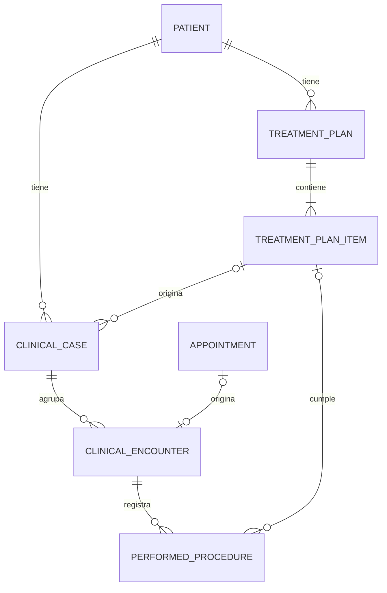

# Casos Clinicos Especializados

## Objetivo

Definir como OdonCRM debe conservar los detalles clinicos de tratamientos simples y especializados sin crear un plan independiente por cada procedimiento ni convertir el presupuesto en una historia clinica.

## Regla Principal

```text
Plan de tratamiento = que se propone
Revision de presupuesto = cuanto cuesta y que acepto el paciente
Item del plan = unidad propuesta y trazable
Caso clinico = seguimiento especializado longitudinal
Cita = cuando se atiende
Encuentro clinico = que ocurrio durante la atencion
Procedimiento realizado = que se ejecuto realmente
```

Un paciente puede tener varios planes y varios casos a lo largo del tiempo. Un plan contiene varios items. Solamente los items que necesitan seguimiento especializado crean o se vinculan con un caso clinico.

## Niveles De Registro

### Nivel 1: procedimiento simple planificado

Ejemplos:

- Limpieza.
- Resina simple.
- Extraccion no compleja.
- Blanqueamiento.

Registro requerido:

- Item del plan.
- Cita.
- Encuentro clinico.
- Procedimiento realizado.
- Pieza o superficie cuando corresponda.
- Profesional, fecha, resultado y notas necesarias.

No requiere un caso especializado por defecto.

La atencion urgente puede crear encuentro y procedimiento realizado sin plan ni cita previos, conforme al flujo abreviado de `02_FLUJOS_Y_REGLAS.md`. Si quedan necesidades definitivas, se genera el plan posterior sin alterar el registro urgente.

### Nivel 2: tratamiento especializado o multisesion

Ejemplos:

- Endodoncia.
- Ortodoncia.
- Tratamiento periodontal.
- Rehabilitacion extensa.
- Cirugia con controles sucesivos.

Registro requerido:

- Item del plan.
- Caso clinico especializado.
- Uno o varios encuentros.
- Uno o varios procedimientos realizados.
- Documentos, imagenes y controles propios de la especialidad.

### Nivel 3: seguimiento longitudinal independiente

Un caso puede comenzar antes de que exista un presupuesto, por ejemplo durante una evaluacion endodontica u ortodontica. Cuando se aprueba el tratamiento, el caso se vincula al item correspondiente sin perder su historia previa.

## Modelo General



## Configuracion Del Catalogo

Cada procedimiento puede declarar:

```text
requires_clinical_case
clinical_case_type nullable
commercial_price
duration_minutes
default_sessions
specialty_id nullable
```

Ejemplos:

| Procedimiento | Requiere caso | Tipo sugerido |
|---|---:|---|
| Limpieza | No | - |
| Resina simple | No | - |
| Endodoncia | Si | `endodontic` |
| Ortodoncia | Si | `orthodontic` |
| Tratamiento periodontal | Si | `periodontal` |

La configuracion propone un comportamiento, pero el profesional autorizado puede abrir un caso cuando la complejidad clinica lo justifique.

## Caso De Ortodoncia

Ortodoncia es un caso longitudinal, no un plan nuevo por cada control.

### Cabecera

- Tipo de tratamiento.
- Fecha de inicio.
- Duracion estimada.
- Profesional responsable.
- Estado del caso.
- Objetivos clinicos.
- Plan ortodontico.
- Fase actual.
- Fecha estimada de finalizacion.

### Registros iniciales

- Diagnostico ortodontico.
- Fotografias intraorales y extraorales.
- Radiografias.
- Modelos o escaneos.
- Odontograma relevante.
- Analisis y mediciones.

### Controles

- Fecha y profesional.
- Aparatologia o tecnica.
- Ajustes realizados.
- Hallazgos.
- Incidencias.
- Indicaciones al paciente.
- Proximo control.
- Progreso esperado y real.

### Finalizacion

- Resultado.
- Motivo de cierre.
- Registros finales.
- Plan de retencion.
- Controles posteriores.

Modelo sugerido:

- `orthodontic_cases`
- `orthodontic_controls`
- `orthodontic_measurements`
- `clinical_documents`

## Caso De Endodoncia

Una endodoncia normalmente se registra como caso por pieza.

### Evaluacion

- Pieza.
- Motivo de consulta.
- Historia de dolor.
- Duracion, frecuencia y desencadenantes.
- Trauma.
- Hallazgos objetivos.
- Pruebas de vitalidad.
- Hallazgos radiograficos.

### Diagnostico

- Diagnostico pulpar.
- Diagnostico periapical.
- Pronostico.
- Indicacion de tratamiento o retratamiento.

### Tratamiento

- Anestesia.
- Aislamiento.
- Numero y configuracion de conductos.
- Longitud de trabajo.
- Instrumentacion.
- Irrigacion.
- Medicacion intraconducto.
- Tecnica y material de obturacion.
- Restauracion temporal o definitiva.
- Complicaciones.

### Sesiones y controles

- Fecha y profesional.
- Conductos tratados.
- Procedimientos realizados.
- Radiografias.
- Evolucion.
- Indicaciones.
- Proximo control.

Modelo sugerido:

- `endodontic_cases`
- `endodontic_canals`
- `endodontic_sessions`
- `clinical_documents`

## Caso De Periodoncia

### Evaluacion

- Diagnostico periodontal.
- Profundidad de sondaje.
- Sangrado.
- Recesion.
- Movilidad.
- Furcacion.
- Placa y calculo.
- Hallazgos radiograficos.

### Plan y seguimiento

- Fases del tratamiento.
- Procedimientos por cuadrante o pieza.
- Reevaluaciones.
- Comparacion de mediciones.
- Mantenimiento periodontal.

Modelo sugerido:

- `periodontal_cases`
- `periodontal_exams`
- `periodontal_measurements`
- `clinical_documents`

## Dependencias De Laboratorio Y Dispositivos

Los casos de ortodoncia, protesis, rehabilitacion e implantes pueden relacionarse con casos de laboratorio y dispositivos trazables. El caso especializado conserva el contexto longitudinal; no debe duplicar estados de laboratorio, lotes ni seriales.

- El readiness de laboratorio se resuelve desde `dental_laboratory_cases` y sus eventos.
- El dispositivo realmente usado se registra en `performed_procedure_material_usages`.
- Un ajuste, remake, retiro o reemplazo crea nuevos eventos sin sobrescribir la evidencia original.
- Los modelos y reglas autoritativos se definen en `01_MODELO_DATOS.md` y `02_FLUJOS_Y_REGLAS.md`.

## Encuentro Clinico Y Diario

El diario clinico debe ser una proyeccion cronologica de encuentros y procedimientos realizados, no una coleccion aislada de notas.

Cada entrada debe mostrar:

- Fecha y hora.
- Profesional.
- Cita relacionada.
- Caso relacionado cuando exista.
- Hallazgos.
- Evaluacion.
- Plan o indicaciones.
- Procedimientos realizados.
- Documentos asociados.
- Firma y enmiendas.

## Documentos Clinicos

Fotografias, radiografias, recetas y documentos deben:

- Pertenecer a la clinica y al paciente.
- Vincularse opcionalmente a caso, encuentro, cita o plan.
- Guardarse en storage privado.
- Descargarse mediante controlador autorizado.
- Registrar autor, fecha, tipo y descripcion.
- Conservar versiones o reemplazos sin perder trazabilidad.
- No exponerse directamente mediante rutas publicas de storage.

## Formularios Especializados

La interfaz puede variar por `case_type`, pero los datos clinicos importantes no deben almacenarse en un unico JSON sin estructura.

Recomendacion:

- Tabla base `clinical_cases` para datos comunes.
- Tablas especializadas para campos clinicos propios.
- Componentes Filament separados por especialidad.
- JSON solamente para metadata no critica o extensiones controladas.
- Catalogos y Enums para valores clinicos repetibles.

Esto permite validar, consultar, auditar y generar reportes sin depender de formularios opacos.

## Permisos Y Firma

- Recepcion puede ver estado y agenda, no necesariamente el detalle clinico.
- Doctores acceden segun responsabilidad, delegacion y politica de clinica.
- Asistentes acceden solo a informacion necesaria para su funcion.
- Los encuentros firmados son inmutables.
- Las correcciones crean enmiendas con autor, fecha y motivo.
- Toda visualizacion o descarga sensible debe respetar tenant y permisos.

## Integracion Con El Plan

Ejemplo:

```text
Plan PT-001
├── Limpieza
│   └── Procedimiento realizado sin caso especializado
├── Endodoncia pieza 11
│   └── Caso endodontico END-001
│       ├── Evaluacion
│       ├── Sesion 1
│       └── Control
└── Ortodoncia
    └── Caso ortodontico ORT-001
        ├── Registros iniciales
        ├── Control 1
        └── Control 2
```

El avance economico se calcula desde aceptaciones y revisiones. El avance clinico se calcula desde procedimientos realizados y estado de los casos. Ambos se muestran juntos, pero no se mezclan.

## Criterios De Aceptacion

1. Un plan puede contener procedimientos simples y especializados.
2. Un procedimiento simple se completa sin crear un caso vacio.
3. Un item especializado puede crear o vincular un caso.
4. Ortodoncia conserva multiples controles en el mismo caso.
5. Endodoncia conserva pieza, conductos, sesiones y radiografias.
6. Periodoncia conserva examenes comparables en el tiempo.
7. Una cita completada no completa automaticamente el item.
8. Un procedimiento realizado actualiza el avance con trazabilidad.
9. Un encuentro firmado solo cambia mediante enmienda.
10. Los detalles clinicos no aparecen en el presupuesto publico.
11. Los documentos permanecen privados y tenant-scoped.
12. No existe acceso cruzado entre pacientes o clinicas.
