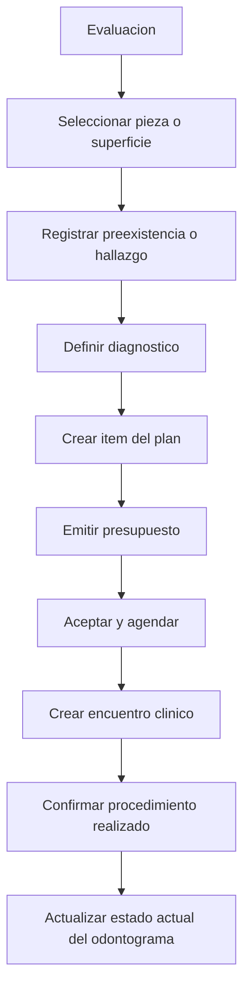

# Odontograma OdonCRM

## Objetivo

Construir un odontograma clinico transversal al paciente que permita registrar preexistencias, hallazgos, diagnosticos, tratamientos propuestos y condiciones resultantes sin confundir el estado clinico con el presupuesto.

El odontograma debe integrarse con planes, casos, encuentros, procedimientos realizados, radiografias y documentos.

## Posicion En El Dominio

```text
Paciente
├── Antecedentes
├── Odontograma
├── Periodontograma
├── Diagnosticos
├── Planes de tratamiento
├── Casos clinicos
├── Encuentros
├── Procedimientos realizados
└── Documentos clinicos
```

El odontograma pertenece al paciente. No se crea uno independiente por presupuesto ni por especialidad.

## Flujo Clinico



Aceptar un presupuesto no modifica el odontograma. Solamente una accion clinica autorizada, firmada y trazable puede cambiar su estado actual.

## Vistas

### Estado actual

Muestra condiciones existentes:

- Restauraciones.
- Coronas.
- Implantes.
- Endodoncias.
- Piezas ausentes.
- Protesis.
- Puentes.
- Sellantes.
- Tratamientos previamente realizados.

### Diagnostico

Muestra condiciones activas:

- Caries.
- Fracturas.
- Restauraciones filtradas.
- Lesiones.
- Movilidad.
- Extraccion indicada.
- Diagnosticos pulpares o periapicales.
- Alertas clinicas relacionadas.

### Plan de tratamiento

Muestra tratamientos propuestos:

- Restauraciones.
- Coronas.
- Endodoncias.
- Extracciones.
- Implantes.
- Protesis.
- Tratamientos preventivos o periodontales.

### Historial

Permite seleccionar una fecha y reconstruir el estado conocido del odontograma en ese momento.

## Clasificacion De Entradas

- `preexisting_condition`
- `clinical_finding`
- `diagnosis`
- `planned_treatment`
- `completed_treatment`

Ejemplo:

| Tipo | Pieza | Superficie | Condicion |
|---|---|---|---|
| Preexistencia | 22 | Distal | Restauracion antigua |
| Hallazgo | 22 | Distal | Restauracion filtrada |
| Diagnostico | 22 | Distal | Caries secundaria |
| Tratamiento propuesto | 22 | Distal | Restauracion en resina |
| Tratamiento realizado | 22 | Distal | Restauracion en resina |

Cada etapa es un registro distinto y conserva su origen.

## Modelo De Datos

### `odontograms`

```text
id
clinic_id
patient_id
dentition_type
status
recorded_at
recorded_by
signed_at nullable
created_at
updated_at
```

### `odontogram_entries`

```text
id
clinic_id
odontogram_id
patient_id
clinical_encounter_id nullable
treatment_plan_item_id nullable
performed_procedure_id nullable
tooth_code nullable
entry_type
condition_code
status
severity nullable
diagnosis_text nullable
observations nullable
recorded_by
recorded_at
resolved_at nullable
created_at
updated_at
```

### `odontogram_entry_surfaces`

```text
id
clinic_id
odontogram_entry_id
surface
created_at
```

Superficies sugeridas:

- `mesial`
- `distal`
- `vestibular`
- `lingual`
- `palatal`
- `occlusal`
- `incisal`
- `cervical`
- `root`
- `whole_tooth`

### `odontogram_entry_targets`

Permite representar condiciones que afectan mas de una pieza o una estructura distinta de una superficie dental:

```text
id
clinic_id
odontogram_entry_id
target_type
target_code
tooth_code nullable
surface nullable
sequence_order
```

Tipos sugeridos:

- `tooth`
- `surface`
- `multiple_teeth`
- `quadrant`
- `arch`
- `edentulous_span`
- `implant`
- `oral_region`

Este modelo permite puentes, protesis, aparatos, espacios edentulos y hallazgos no limitados a una sola pieza.

### `odontogram_events`

```text
id
clinic_id
odontogram_id
odontogram_entry_id nullable
event_type
occurred_at
created_by
source
metadata nullable
created_at
```

Eventos sugeridos:

- `entry_created`
- `entry_corrected`
- `entry_resolved`
- `diagnosis_confirmed`
- `treatment_planned`
- `treatment_completed`
- `odontogram_signed`

### `odontogram_condition_catalog`

Catalogo configurable por clinica:

```text
id
clinic_id nullable
code
name
category
entry_type
symbol
color
applies_to
requires_surface
is_active
display_order
```

Puede contener condiciones globales y personalizaciones tenant-scoped.

## Numeracion Dental

El sistema debe usar FDI como identificador canonico y validar conjuntos explicitos, no rangos numericos inclusivos:

```text
Permanentes:
11 12 13 14 15 16 17 18
21 22 23 24 25 26 27 28
31 32 33 34 35 36 37 38
41 42 43 44 45 46 47 48

Temporales:
51 52 53 54 55
61 62 63 64 65
71 72 73 74 75
81 82 83 84 85
```

Debe soportar:

- Denticion temporal.
- Denticion mixta.
- Denticion permanente.
- Pieza ausente.
- Pieza no erupcionada o incluida.
- Pieza supernumeraria mediante identificador complementario.
- Implantes y espacios edentulos.

La interfaz puede mostrar `1.1` o `11`, pero la base debe conservar un formato canonico consistente.

## Interaccion Visual

El usuario debe poder seleccionar:

- Pieza completa.
- Una superficie.
- Varias superficies.
- Varias piezas.
- Cuadrante.
- Arcada.

Funciones recomendadas:

- Panel de condiciones con buscador.
- Categorias de preexistencia, hallazgo, diagnostico y tratamiento.
- Condiciones favoritas y recientes.
- Leyenda visible.
- Vista combinada y filtros por capa.
- Deshacer antes de guardar.
- Confirmacion para operaciones masivas.
- Historial por pieza.
- Comparacion entre fechas.
- Soporte para mouse y pantalla tactil.
- Simbolos comprensibles sin depender solamente del color.

## Integracion Con Planes

Un hallazgo puede producir uno o varios diagnosticos y cada diagnostico puede originar items del plan.

```text
Hallazgo pieza 22
-> Diagnostico: caries secundaria
-> Item: restauracion en resina pieza 22
-> Revision y aceptacion
-> Cita
-> Procedimiento realizado
-> Hallazgo resuelto
-> Nueva condicion actual: restauracion
```

No se debe borrar el hallazgo anterior. Se marca resuelto y se registra la nueva condicion.

## Integracion Con Casos

- Un diagnostico pulpar puede abrir un caso endodontico.
- Hallazgos periodontales se detallan en el periodontograma.
- Ortodoncia utiliza el odontograma como registro base y lo complementa con su caso longitudinal.
- Un procedimiento realizado puede actualizar odontograma y caso dentro de la misma transaccion clinica.

Los implantes, protesis u otros dispositivos pueden proyectar una condicion visible en el odontograma. La identidad del producto, lote, serial y estado del laboratorio permanecen en las entidades del procedimiento realizado y laboratorio; no se duplican en el odontograma.

## Periodontograma

El periodontograma es un modulo separado porque necesita mediciones por sitio:

- Profundidad de sondaje.
- Recesion.
- Nivel de insercion clinica.
- Sangrado.
- Placa.
- Supuracion.
- Movilidad.
- Furcacion.

Cada pieza puede tener seis sitios:

- Mesiovestibular.
- Vestibular.
- Distovestibular.
- Mesiolingual o mesiopalatino.
- Lingual o palatino.
- Distolingual o distopalatino.

El odontograma puede mostrar un resumen, pero las mediciones permanecen en entidades periodontales.

## Firma Y Correcciones

- Un odontograma en borrador puede editarse.
- Al firmarlo se crea una referencia temporal del estado evaluado.
- Los registros firmados no se sobrescriben.
- Las correcciones crean eventos y enmiendas.
- Toda entrada registra profesional, fecha, fuente y encuentro.
- Las eliminaciones clinicas se representan como anulaciones trazables.

## Permisos

- `odontograms.view`
- `odontograms.create`
- `odontograms.update_draft`
- `odontograms.sign`
- `odontograms.amend`
- `odontograms.add_finding`
- `odontograms.add_diagnosis`
- `odontograms.plan_treatment`
- `odontograms.view_history`
- `periodontograms.view`
- `periodontograms.record`
- `periodontograms.sign`

Recepcion no debe modificar hallazgos ni diagnosticos. Los detalles clinicos requieren autorizacion por rol, profesional y tenant.

## Criterios De Aceptacion

1. El odontograma pertenece al paciente y no al presupuesto.
2. Permite denticion temporal, mixta y permanente.
3. Registra condiciones por pieza y superficie.
4. Separa preexistencias, hallazgos, diagnosticos y tratamientos.
5. Genera items del plan sin duplicar datos clinicos.
6. Solo procedimientos realizados actualizan el estado actual.
7. Conserva historial reconstruible por fecha.
8. Los registros firmados se corrigen mediante enmienda.
9. El periodontograma conserva mediciones independientes.
10. No existe acceso cruzado entre clinicas.
