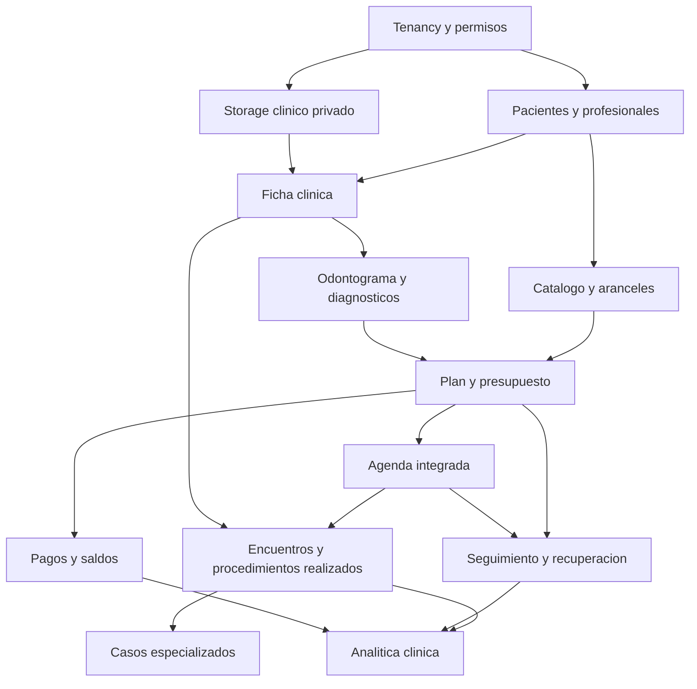

# Mapa De Modulos Recomendados Para OdonCRM

## Fuente De Referencia

Analisis funcional basado en la playlist publica de Dentalink:

`https://www.youtube.com/playlist?list=PL2WA0glWkzID7P8uJaA1ufE4HL773UKRk`

La playlist contiene 43 videos sobre pacientes, agenda, ficha clinica, odontograma, periodontograma, rayos X, planes de tratamiento, recetas, documentos, consentimientos, aranceles, pagos, cajas, reportes, laboratorios, inventario, profesionales y CRM.

Dentalink se utiliza como referencia funcional, no como especificacion tecnica ni visual para copiar. OdonCRM debe conservar su diferenciador: CRM social, WhatsApp, atribucion, agenda inteligente y recuperacion de pacientes.

## Criterio De Producto

OdonCRM debe evolucionar como un sistema clinico-comercial conectado. Los modulos se separan para evitar mezclar:

- Datos administrativos del paciente.
- Informacion clinica.
- Propuesta y aceptacion economica.
- Agenda y operacion del dia.
- Ejecucion clinica.
- Cobranza y contabilidad.
- Seguimiento comercial.

## Modulos Existentes Que Se Extienden

### 1. Pacientes

Estado actual: existe ficha basica con nombre, telefono, fecha de nacimiento y notas.

Extensiones necesarias:

- Identificacion y datos de contacto completos.
- Contacto de emergencia.
- Preferencias de comunicacion.
- Consentimiento y opt-out.
- Alertas clinicas visibles segun permisos.
- Resumen de planes, citas, casos, documentos y saldos.
- Responsable financiero, tutor o representante autorizado cuando corresponda.
- Idioma preferido y necesidad de interprete.

### 2. Profesionales

Estado actual: existen doctores, auxiliares y asignaciones.

Extensiones necesarias:

- Especialidades.
- Competencias por procedimiento.
- Horarios y excepciones.
- Firma profesional.
- Permisos clinicos por membresia.

### 3. Agenda Y Patient Flow

Estado actual: citas, disponibilidad, estados operativos, recordatorios, Google Calendar y enlaces publicos.

Extensiones necesarias:

- Multiples citas futuras por paciente.
- Duracion derivada de procedimientos.
- Relacion de items del plan con citas.
- Reserva atomica.
- Horarios individuales por profesional.
- Reprogramacion validada en todos los canales.
- Agenda online integrada al tratamiento.

### 4. CRM, WhatsApp Y Recuperacion

Estado actual: pipeline social, WhatsApp, Smart Links, alertas, scoring, ROI y Pity Voice.

Extensiones necesarias:

- Seguimiento de planes y tratamientos pendientes.
- Consentimiento y frecuencia de contacto.
- Plantillas WhatsApp aprobadas.
- Candidatos para brechas de agenda.
- Valor derivado de planes reales.
- Historial de contacto por paciente.

### 5. Analitica

Estado actual: ROI social y metricas operativas de citas.

Extensiones necesarias:

- Valor presupuestado y aceptado.
- Valor realizado y pendiente.
- Conversion de diagnostico a plan.
- Conversion de plan a cita.
- Conversion de cita a procedimiento realizado.
- Avance clinico por plan.
- Recuperacion de agenda.

## Modulos Nuevos Fundamentales

### 6. Catalogo Clinico Y Aranceles

Responsabilidades:

- Procedimientos.
- Precio comercial separado de tarifa interna.
- Duracion y sesiones.
- Especialidad.
- Vigencia de precios.
- Listas de precios cuando sean necesarias.
- Limites y aprobacion de descuentos.
- Snapshot de precio al emitir un plan.
- Conceptos clinicos globales separados de nombres y codigos regionales.
- Paquetes de pais versionados para terminologia y configuracion sugerida.
- Listas de precios publicadas por clinica, convenio o pagador.
- Moneda y reglas de redondeo por lista.
- Clasificacion fiscal por item facturable y fecha efectiva.

Es dependencia del plan de tratamiento y no debe confundirse con facturacion.
Especificacion regional y fiscal: `08_CATALOGOS_REGIONALES_Y_FISCALIDAD.md`.

### 7. Ficha Clinica Y Antecedentes

Responsabilidades:

- Antecedentes medicos y odontologicos.
- Alergias.
- Medicamentos.
- Condiciones relevantes.
- Alertas clinicas.
- Evaluaciones.
- Evoluciones.
- Firma y enmiendas.
- Cuestionarios versionados y procedencia de cada respuesta.
- Revision profesional y reconocimiento de alertas.
- Signos vitales cuando la practica los requiera.

Las notas operativas actuales no sustituyen este modulo.

### 8. Odontograma Y Diagnosticos

Responsabilidades:

- Denticion temporal, mixta y permanente.
- Preexistencias.
- Hallazgos.
- Diagnosticos.
- Tratamientos propuestos.
- Condiciones resultantes.
- Registro por pieza y superficie.
- Historial por fecha.
- Generacion de items del plan.

Especificacion: `05_ODONTOGRAMA.md`.

### 9. Periodontograma

Responsabilidades:

- Mediciones por pieza y sitio.
- Profundidad de sondaje.
- Recesion y nivel de insercion.
- Sangrado, placa y supuracion.
- Movilidad y furcacion.
- Comparacion entre evaluaciones.
- Generacion de diagnosticos e items periodontales.

Debe integrarse con el odontograma sin almacenar sus mediciones dentro de este.

### 10. Plan De Tratamiento Y Presupuesto

Responsabilidades:

- Planes e items.
- Revisiones inmutables.
- Precios, descuentos, impuestos y vigencia.
- Aceptacion total o parcial.
- Enlace publico seguro.
- PDF o representacion imprimible.
- Estados comerciales y clinicos separados.
- Seguimiento de items aceptados sin cita.

Es el centro de la propuesta actual.

### 11. Casos Clinicos Especializados

Responsabilidades:

- Caso clinico base.
- Ortodoncia longitudinal.
- Endodoncia por pieza y conductos.
- Periodoncia longitudinal.
- Controles, sesiones y documentos.
- Estado y avance del caso.

No todo procedimiento crea un caso. Especificacion: `04_CASOS_CLINICOS_ESPECIALIZADOS.md`.

### 12. Encuentros Y Procedimientos Realizados

Responsabilidades:

- Registro de la atencion clinica.
- Hallazgos y evaluacion del encuentro.
- Procedimientos efectivamente realizados.
- Profesional, fecha, pieza, superficie y cantidad.
- Firma y enmiendas.
- Actualizacion trazable del plan y odontograma.

Una cita completada no equivale automaticamente a un procedimiento realizado.

### 13. Evaluacion Y Diagnosticos

Responsabilidades:

- Motivo de consulta.
- Tipo y alcance del examen.
- Hallazgos extraorales, intraorales y de tejidos blandos.
- Pruebas y evidencia diagnostica.
- Diagnosticos provisionales, confirmados, descartados o resueltos.
- Relacion hallazgo-diagnostico-plan.
- Examen incompleto o rechazado.

### 14. Documentos Clinicos Y Rayos X

Responsabilidades:

- Fotografias.
- Radiografias.
- Archivos y resultados.
- Clasificacion y descripcion.
- Vinculacion con paciente, caso, encuentro, cita o plan.
- Storage privado.
- Descarga autorizada.
- Historial de versiones.

### 15. Recetas

Responsabilidades:

- Prescripciones.
- Medicamento, dosis, frecuencia y duracion.
- Indicaciones.
- Profesional y firma.
- Documento imprimible.
- Historial y anulaciones.

No debe enviar una receta generada libremente por IA.

### 16. Consentimientos Y Plantillas Clinicas

Responsabilidades:

- Plantillas versionadas.
- Variables del paciente y tratamiento.
- Consentimiento asociado a revision o procedimiento.
- Firma, fecha y evidencia.
- Revocacion o nueva version.
- Documentos clinicos configurables.

### 17. Citas Planificadas

Responsabilidades:

- Agrupar items clinicamente listos antes de asignar fecha.
- Definir secuencia, profesional, duracion y notas de preparacion.
- Mantener una cola de citas planificadas sin agendar.
- Retornar items a la cola ante cancelacion o no-show.

### 18. Seguimiento Clinico Y Recall

Responsabilidades:

- Controles postoperatorios.
- Tareas clinicas pendientes.
- Recall preventivo configurable.
- Mantenimiento periodontal.
- Cola de pacientes vencidos o proximos.
- Historial de contacto separado del seguimiento comercial.

### 19. Referidos Y Autorizaciones

Responsabilidades:

- Referido desde y hacia otro profesional.
- Motivo, estado y documentos.
- Autorizacion o evaluacion medica requerida.
- Resultado recibido.
- Impacto sobre la preparacion del tratamiento.

## Modulos De Evolucion Independiente

### 20. Pagos, Abonos Y Saldos

Responsabilidades futuras:

- Abonos por plan o item.
- Pagos y asignaciones.
- Cuotas.
- Saldos.
- Anulaciones y devoluciones.
- Recibos.
- Integracion con proveedor de pago.

Debe construirse despues de estabilizar revisiones, aceptacion y procedimientos realizados.

### 21. Caja, Gastos Y Bancos

Es un dominio contable separado:

- Apertura y cierre de caja.
- Ingresos y egresos.
- Bancos.
- Conciliacion.
- Gastos.
- Auditoria financiera.

No es requisito para que funcionen odontograma, plan y recuperacion.

### 22. Laboratorios

Responsabilidades futuras:

- Ordenes de laboratorio.
- Proveedor.
- Pieza o trabajo solicitado.
- Fechas de envio y entrega.
- Estado.
- Costos y documentos.
- Vinculacion con plan, caso y cita.

### 23. Inventario

Responsabilidades futuras:

- Productos e insumos.
- Movimientos.
- Lotes y vencimientos.
- Consumo por procedimiento.
- Alertas de stock.
- Proveedores.

No debe bloquear el nucleo clinico inicial.

### 24. Recursos Fisicos

El control de sillones o boxes solo debe implementarse si la operacion real lo necesita.

Posibles responsabilidades:

- Recurso disponible.
- Agenda por recurso.
- Capacidad simultanea.
- Mantenimiento o bloqueos.

No se contempla gestion de sucursales.

## Funciones De Dentalink Que No Debemos Replicar Como Modulo

- Pago o reactivacion de la suscripcion de Dentalink.
- Portal de ayuda como parte del nucleo clinico.
- Configuracion duplicada de logotipo.
- Un CRM adicional separado del CRM actual de OdonCRM.
- Tipos de agenda que reemplacen sin necesidad el flujo existente.
- Facturacion completa antes de tener ejecucion clinica y saldos confiables.

## Orden Recomendado De Construccion

### Bloque 1: Fundacion y seguridad

1. RLS y tenant fail-closed.
2. Permisos clinicos granulares.
3. Pacientes y profesionales ampliados.
4. Catalogo clinico, especialidades y aranceles.
5. Storage clinico privado.

### Bloque 2: Registro clinico

1. Antecedentes y alertas.
2. Evaluacion y diagnosticos.
3. Encuentros y firma.
4. Odontograma y periodontograma.
5. Documentos y rayos X.
6. Procedimientos realizados.
7. Consentimientos clinicos.

### Bloque 3: Planificacion

1. Planes e items.
2. Revisiones y presupuesto.
3. Aceptacion parcial.
4. Consentimientos.
5. Recetas.

### Bloque 4: Agenda integrada

1. Fases, dependencias y preparacion clinica.
2. Citas planificadas.
3. Multiples citas futuras.
4. Items por cita.
5. Duracion por procedimiento.
6. Reserva atomica.
7. Actualizacion clinica al finalizar.

### Bloque 5: Especialidades

1. Caso clinico base.
2. Endodoncia.
3. Ortodoncia.
4. Periodoncia y periodontograma.
5. Otras especialidades segun demanda real.

### Bloque 6: Seguimiento y recuperacion

1. Seguimiento clinico y controles.
2. Recall preventivo.
3. Planes sin respuesta.
4. Items aceptados sin cita.
5. Brechas de agenda.
6. Recomendacion explicable.
7. WhatsApp y Pity Voice.

### Bloque 7: Finanzas y operacion ampliada

1. Pagos, abonos y saldos.
2. Caja y gastos.
3. Laboratorios.
4. Inventario.
5. Recursos fisicos si aplican.

## Dependencias

## Recomendacion Final

Los modulos que convierten a OdonCRM en sistema odontologico son:

1. Ficha clinica y antecedentes.
2. Catalogo y aranceles.
3. Odontograma y diagnosticos.
4. Periodontograma.
5. Plan de tratamiento y presupuesto.
6. Encuentros y procedimientos realizados.
7. Casos clinicos especializados.
8. Documentos, rayos X, recetas y consentimientos.
9. Agenda integrada al tratamiento.
10. Seguimiento y recuperacion inteligente.

Pagos, cajas, inventario y laboratorios son valiosos, pero no deben definir ni retrasar la arquitectura clinica central.
