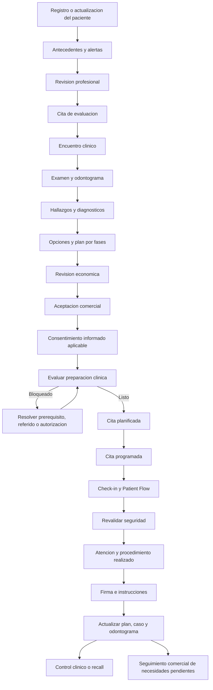

# Validacion Del Flujo Clinico OdonCRM

## Objetivo

Validar que la propuesta permita trabajar de forma segura y practica durante el dia a dia de una clinica odontologica, no solamente crear presupuestos y citas.

Esta revision compara la propuesta con patrones documentados publicamente por Dentalink, Open Dental, Curve Dental, CareStack y Dentrix Ascend. No certifica cumplimiento clinico, legal o regulatorio. Los requisitos finales deben validarse con odontologos responsables y asesoria local en cada pais de operacion.

## Veredicto

La propuesta es fuerte en:

- Revisiones de presupuesto inmutables.
- Aceptacion parcial por item.
- Separacion entre estado comercial y ejecucion clinica.
- Distincion entre cita, encuentro y procedimiento realizado.
- Trazabilidad desde CRM y WhatsApp.
- Recuperacion de tratamientos aceptados sin cita.
- Arquitectura tenant-aware.

La propuesta original no era suficiente por si sola para operacion clinica completa porque faltaban controles obligatorios previos y posteriores al tratamiento. Este documento incorpora esos requisitos como baseline clinico.

## Baseline Clinico Obligatorio

Antes de permitir ejecucion clinica, el sistema debe cubrir:

1. Identidad del paciente y representante cuando corresponda.
2. Antecedentes medicos y odontologicos versionados.
3. Alergias, medicamentos, condiciones y alertas.
4. Revision y reconocimiento profesional de la informacion de seguridad.
5. Motivo de consulta, examen, hallazgos y diagnosticos estructurados.
6. Odontograma longitudinal y periodontograma cuando aplique.
7. Plan por fases, dependencias y alternativas.
8. Aceptacion economica separada del consentimiento informado.
9. Evaluacion de preparacion clinica antes de agendar y ejecutar.
10. Encuentro firmado y enmiendas append-only.
11. Procedimientos realizados con resultados y correcciones trazables.
12. Instrucciones, recetas y seguimiento postoperatorio cuando correspondan.
13. Recall preventivo independiente del seguimiento comercial.
14. Cierre clinico que preserve necesidades rechazadas, diferidas o referidas.

## Flujo Diario Objetivo



## Flujo De Recepcion

Recepcion necesita una vista operativa que permita:

1. Identificar paciente y representante autorizado.
2. Ver formularios pendientes sin acceder a detalles clinicos innecesarios.
3. Confirmar que el item esta listo para agendar.
4. Crear o convertir una cita planificada.
5. Confirmar, reprogramar y registrar cancelacion o no-show.
6. Realizar check-in.
7. Gestionar espera, preparacion, salida y proxima cita.
8. Programar seguimiento aprobado por el equipo clinico.

Recepcion no confirma diagnosticos, no firma encuentros y no elimina bloqueos clinicos.

## Flujo Del Doctor

El doctor necesita:

1. Alertas, alergias, medicamentos y cambios recientes visibles.
2. Confirmar que reviso antecedentes antes de tratar.
3. Documentar examen, hallazgos y diagnosticos.
4. Construir opciones y secuencias clinicas.
5. Explicar alternativas y registrar decisiones.
6. Confirmar consentimiento aplicable.
7. Registrar procedimientos intentados, parciales, completados o abortados.
8. Documentar complicaciones, instrucciones y seguimiento.
9. Firmar el encuentro.
10. Corregir mediante enmienda sin sobrescribir el original.

## Flujo De Planificacion

El plan requiere:

- Fases ordenadas.
- Dependencias entre items.
- Intervalos de cicatrizacion.
- Alternativas mutuamente excluyentes.
- Bloqueos por resultado, referido o autorizacion.
- Estado de preparacion independiente de la aceptacion.
- Citas planificadas antes de asignar fecha.

Ejemplo:

```text
Fase 1: control de infeccion
├── Endodoncia pieza 11
└── Extraccion pieza 26

Fase 2: restauracion
└── Corona pieza 11
    depende de endodoncia completada

Fase 3: mantenimiento
└── Control y recall
```

## Aceptacion Versus Consentimiento

```text
Aceptacion comercial:
Paciente acepta precio, items y condiciones economicas.

Consentimiento informado:
Paciente o representante confirma que recibio explicacion de procedimiento,
riesgos, beneficios, alternativas y opcion de no tratarse.
```

Uno no sustituye al otro. Un item puede estar comercialmente aceptado y permanecer bloqueado por falta de consentimiento, historia actualizada, resultado diagnostico, referido o autorizacion.

## Ejecucion Y Resultados

Los procedimientos realizados deben soportar:

- `planned`
- `started`
- `partially_completed`
- `completed`
- `aborted`
- `failed`
- `redone`
- `externally_completed`
- `voided`

Cada resultado registra profesional, participantes, cantidad, sesion, motivo, complicaciones, fecha, firma y cadena de correccion. El avance del plan se calcula con reglas deterministas y no solamente por cerrar una cita.

## Seguimiento Clinico Y Recall

Se deben separar tres colas:

### Seguimiento clinico

- Control postoperatorio.
- Sintomas o complicaciones.
- Resultado pendiente.
- Reevaluacion.
- Mantenimiento periodontal.

### Recall preventivo

- Tipo de recall.
- Intervalo general o individual.
- Ultima realizacion.
- Fecha calculada y fecha ajustada.
- Estado, notas y contactos.
- Proxima cita relacionada.

### Seguimiento comercial

- Plan no visto.
- Plan sin respuesta.
- Item pendiente de decision.
- Item aceptado sin cita.

## Cierre Correcto

El sistema debe diferenciar:

- Cierre administrativo del plan.
- Cierre comercial de la oportunidad.
- Finalizacion de una fase.
- Resolucion clinica de un diagnostico.
- Necesidad rechazada o diferida.
- Tratamiento referido o realizado externamente.

Un plan no debe mostrarse como clinicamente completo si conserva diagnosticos activos sin disposicion documentada.

## Brechas Identificadas Y Decision

| Brecha | Prioridad | Decision recomendada |
|---|---|---|
| Antecedentes, alergias y medicamentos | Obligatoria | Incorporar antes de ejecucion clinica |
| Examen y diagnostico estructurado | Obligatoria | Crear entidades propias |
| Consentimiento informado | Obligatoria | Separar de aceptacion comercial |
| Fases, dependencias y alternativas | Obligatoria | Incorporar al plan |
| Preparacion clinica | Obligatoria | Crear reglas y bloqueos auditados |
| Firma y enmiendas | Obligatoria | Inmutabilidad y versiones firmadas |
| Seguimiento postoperatorio | Obligatoria | Separar de CRM comercial |
| Recall preventivo | Obligatoria | Crear dominio independiente |
| Responsable o tutor | Obligatoria cuando aplique | Modelar autoridad y firma |
| Referidos y autorizaciones | Requerida | Flujo basico antes de automatizacion |
| Cita planificada | Requerida | Separar aceptado de listo y agendado |
| Finanzas completas | Posterior | No bloquear nucleo clinico |
| Inventario y laboratorios avanzados | Posterior | Integrar cuando exista demanda |
| Recuperacion predictiva | Posterior | Iniciar con filtros explicables |

## Comparacion Con Sistemas

### Dentalink

Baseline observado:

- Ficha e historia clinica.
- Odontograma, periodontograma y rayos X.
- Planes, aranceles, recetas, documentos y consentimientos.
- Agenda, estados de paciente y tareas automaticas.
- Pagos, cajas, laboratorios e inventario.

### Open Dental

Baseline documentado:

- Chart clinico unificado y progress notes.
- Historia medica, alergias, medicamentos y alertas.
- Tooth chart, perio, imagenes y recetas.
- Planes, citas planificadas y recall.
- Familia, garante, seguros, referidos y laboratorios.
- Permisos, lock dates y audit trail.

### Curve Dental, CareStack Y Dentrix Ascend

Patrones recurrentes:

- Formularios digitales e historia actualizada.
- Charting, imagenes y periodoncia.
- Fases, alternativas y presentacion del plan.
- Firma remota o portal del paciente.
- Tratamiento aceptado sin agendar.
- Agenda por proveedor y recurso.
- Recall, confirmaciones y cobros.

## Diferenciadores De OdonCRM

Se deben conservar:

1. Revisiones economicas inmutables.
2. Aceptacion parcial vinculada a una version exacta.
3. Estados comerciales y clinicos separados.
4. Cita, encuentro y procedimiento realizado como hechos distintos.
5. Recuperacion explicable con prioridad clinica.
6. WhatsApp, Pity Voice y atribucion social.
7. Casos simples y especializados sin formularios innecesarios.
8. Tenant isolation como requisito de arquitectura.

## Capacidades Que Pueden Esperar

- Contabilidad general y conciliacion bancaria.
- Inventario avanzado.
- Automatizacion completa de laboratorios.
- Integracion directa con sensores e imagenes DICOM.
- Prescripcion electronica conectada a farmacias.
- Procesamiento de seguros si no aplica al mercado inicial.
- Voice charting periodontal.
- Optimizacion predictiva de agenda.
- Control de sillones si la clinica no lo necesita.

## Fuentes Publicas

- Dentalink: `https://www.softwaredentalink.com/funcionalidades/`
- Dentalink historia clinica: `https://www.softwaredentalink.com/experiencia-de-pacientes/historia-clinica`
- Dentalink odontograma: `https://www.softwaredentalink.com/experiencia-de-pacientes/odontograma-y-periodontograma`
- Open Dental Chart: `https://www.opendental.com/manual/chart.html`
- Open Dental Medical: `https://www.opendental.com/manual/medical.html`
- Open Dental Treatment Plan: `https://www.opendental.com/manual/treatmentplan.html`
- Open Dental Planned Appointments: `https://www.opendental.com/manual/apptplanned.html`
- Open Dental Perio: `https://www.opendental.com/manual/perio.html`
- Open Dental Recall: `https://www.opendental.com/manual/recall.html`
- Curve Dental Treatment Plans: `https://www.curvedental.com/treatment-plan`
- CareStack Treatment Plan Board: `https://carestack.zendesk.com/hc/en-us/articles/32950569925652-Explore-the-Treatment-Plan-Board-Feature`
- Dentrix Ascend Clinical Charting: `https://www.dentrixascend.com/dental-solutions/charting-imaging-and-clinical-ai/streamline-clinical-charting/`

## Validaciones Pendientes

Antes de produccion deben definirse por pais y clinica:

- Contenido minimo de historia y encuentro.
- Requisitos de firma y enmienda.
- Retencion de registros de adultos y menores.
- Consentimiento y representacion legal.
- Prescripciones y medicamentos controlados.
- Privacidad, acceso, exportacion y eliminacion.
- Uso de WhatsApp, voz e IA con datos clinicos.
- Terminologia y codificacion aplicables.
- Politica de backup, restauracion y continuidad operativa.
